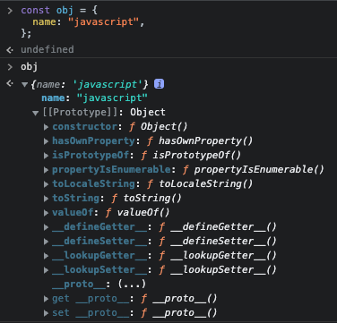
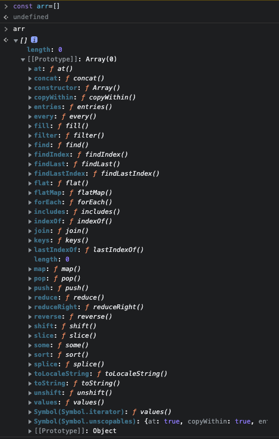
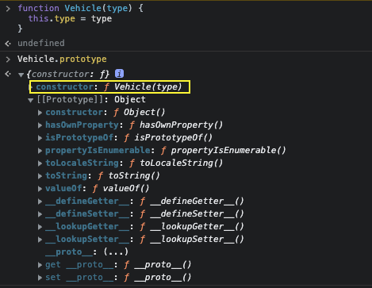
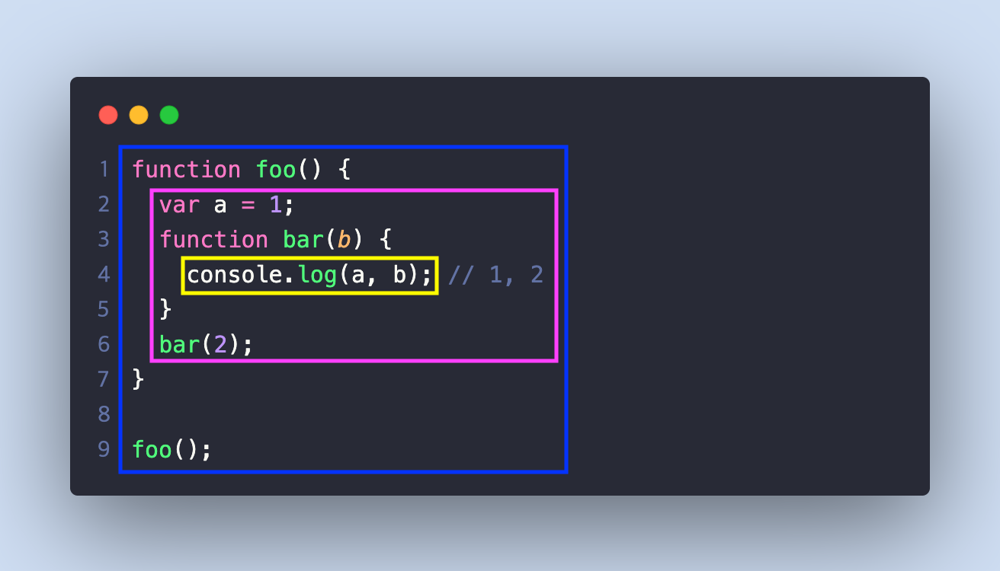

# 프로토타입

자바스크립트에서는 프로토타입을 기반으로 객체 지향의 상속 개념을 구현한다. 모든 객체는 자신의 부모 역할을 하는 **프로토타입 객체의 참조 링크를 가지고 있으며, 이 링크를 통해 프로토타입으로부터 프로퍼티나 메서드를 상속받을 수 있다.** 또한 프로토타입 역시 또 다른 상위 프로토타입으로부터 프로퍼티나 메서드를 상속받을 수 있다.

> `프로토타입` ?<br />
> 자바스크립트의 모든 객체는 최소한 하나 이상의 다른 객체로부터 상속받는데, 상속되는 정보를 제공하는 객체를 프로토타입(prototype)이라고 한다.

## 프로토타입과 프로토타입 체인

객체의 프로토타입은 참조 링크 형태로 `[[Prototype]]` 내부 프로퍼티에 저장된다. **참조 링크 형태로 저장되기 때문에 동일한 프로토타입을 상속받은 객체는 모두 같은 프로퍼티와 메서드를 공유한다.**


이미지의 객체 Obj1, Obj2는 동일한 프로토타입 Parent.prototype을 상속받고 있다. 각 객체는 Parent.prototype의 정보를 [[Prototype]] 프로퍼티에 참조 링크 형태로 저장하고 있다. Parent.prototype은 물리적인 객체가 아닌 참조 링크 형태로 저장되기 때문에 Parent.prototype의 모든 변경 사항은 Obj1, Obj2에 공유된다.

### `[[Prototype]]`과 `__proto__` 프로퍼티

`[[Prototype]]`은 자바스크립트 엔진 내부에서만 사용하는 숨겨진 프로퍼티이지만 크롬, 파이어폭스와 같은 모던 브라우저에서 `__proto__` 프로퍼티로 접근할 수 있다. 하지만 `__proto__` 프로퍼티는 표준 명세가 아니며 이를 통한 프로토타입의 접근도 공직적인 방법은 아니다. 또한 모든 브라우저에서 구현된 프로퍼티가 아니므로 실제 애플리케이션의 코드에서 `__proto__` 프로퍼티는 가급적 사용하지 않는 것이 좋다.

> 만약 `[[Prototype]]`에 접근하고 싶다면 표준 메서드인 `Object.getPrototypeOf()`를 사용하는 것이 좋다. `__proto__`는 엄밀히 보면 단순한 객체(정확히는 `Object.prototype`의 getter)의 프로퍼티이며, 객체의 프로토타입에 접근하기 위한 구시대의 유물이다. 물론 일반 객체의 프로퍼티와는 다르게 동작한다. `__proto__`는 객체 또는 null 값만 허용하며, 다른 타입으로는 수정할 수 없다. 특별한 프로퍼티이기 때문에 납득은 되지만 이러한 예외 동작은 개발자에게 혼란스러울 수도 있다. 추후 자바스크립트 엔진에서 `__proto__`프로퍼티를 더 이상 지원하지 않을 수 있으니, 프로토타입을 찾기 위해서는 `Object.getPrototypeOf()`를 사용하는 것을 권장한다.

#### 프로토타입 체인

아래 예제의 obj 객체에서 `toString()` 메서드를 호출하면 정상적으로 호출된다. 선언된 메서드가 obj 객체 내에 없는데 함수 호츨이 가능한 이유는 프로토타입 체인이라는 개념 때문이다.

```javascript
const obj = {
  name: "javascript",
};

console.log(obj.toString()); // '[Object object]'
```

**프로토타입 체인**은 상위 프로토타입과 연쇄적으로 연결된 구조를 의미한다. 그리고 프로퍼티나 메서드에 접근하기 위해 이 연결 구조를 따라 차례대로 검색하는 것을 **프로토타입 체이닝**이라고 한다. 예제 코드는 다음의 과정처럼 프로토타입 체인을 통해 `toString()` 메서드가 호출된 것이다.

1. obj 객체의 `toString()` 메서드를 호출하기 위해 obj 객체의 프로퍼티나 메서드를 검색한다.
2. 1번 과정에서 `toString()` 메서드를 찾지 못했기 때문에 프로토타입 체인을 통해 상위 프로토타입에서 `toString()` 메서드를 검색한다.
3. 상위 프로토타입에서 `toString()` 메서드를 찾았기 대문에 이 메서드를 호출한다.



obj 객체를 개발자 도구의 콘솔에 출력한 결과를 보면 obj 객체에 name 프로퍼티 외에 `__proto__` 프로퍼티가 있음을 알 수 있다. 바로 이 `__proto__`가 숨겨진 내부 `[[Prototype]]` 프로퍼티 즉 프로토타입을 가리킨다. obj 객체에는 `toString()` 메서드가 없기 때문에 프로토타입 체인을 통해 프로토타입에 있는 `toString()` 메서드를 찾아 호출한다.

#### 최상위 프로토타입

`Object.prototype`은 프로토타입 체인의 최상위에 있는 프로토타입이다. 모든 객체가 가진 프로토타입 체인의 종점은 모두 **Object.prototype**이다. 즉 모든 객체가 Object.prototype을 프로토타입으로써 공유한다는 의미이다.<br />

객체 Obj1, Obj2는 프로토타입 체인을 통해 Parent.prototype으로 연결된다. 그리고 Parent.prototype의 프로토타입은 최상위 프로토타입인 Object.prototype과 연결되어 있다.
객체 뿐만 아니라 배열, 함수 객체, 랩퍼 객체 등 모든 객체는 이러한 프로토타입 구조를 갖는다.

객체의 프로토타입은 객체가 생성되는 시점에 설정된다. 객체 리터럴로 생성한 모든 객체는 최상위 프로토타입인 Object.prototype을 프로토타입으로 설정한다.

#### 다양한 객체의 프로토타입

배열처럼 내장된 객체의 프로토타입은 독특하게 각자 자신의 프로토타입을 따로 정의하고 있다.

```javascript
const arr = [];
```



이미지를 보면 arr 배열의 프로토타입은 Object.prototype과는 다른 것을 알 수 있다. 배열 객체는 프로토타입으로 `Array.prototype`이란 고유의 객체가 설정된다. Array.prototype에는 배열 내장 메서드들이 모두 정의되어 있다. 배열 객체에서 이 내장 메서드들을 호출할 수 있었던 이유가 바로 프로토타입 체인을 통해 Array.prototype의 메서드를 검색하여 사용했기 때문이다.<br />
Array.prototype 내장 프로토타입 또한 자신의 프로토타입을 갖는데, 바로 최상위 프로토타입인 Object.prototype이다.<br />
자바스크립트에는 배열 외에도 랩퍼 객체, 함수, 정규식과 같은 내장 객체들이 있다. 이러한 객체들 역시 자신의 고유한 프로토타입을 따로 가지고 있기 때문에 다양한 메서드나 프로퍼티들을 사용할 수 있는 것이다.

## 프로토타입과 생성자 함수

모든 함수에는 prototype이라는 특별한 프로퍼티가 존재한다. 일반적인 함수에서는 prototype 프로퍼티를 사용할 일이 없지만, new 키워드와 함께 생서자 함수로 사용할 경우에는 특별한 역할을 한다. 여기서 중요한 점은 객체의 프로토타입을 가리키는 참조 링크 [[Prototype]]과 함수의 prototype 프로퍼티를 구분해야 한다는 점이다. **함수의 prototype 프로퍼티**는 특별한 역할을 수행하긴 하지만 일반적인 객체의 프로퍼티이며, 프로토타입을 가리키는 참조 링크가 아니다.

### 객체의 생성과 함수의 prototype 프로퍼티

생성자 함수로 생성된 객체는 '생성자 함수의 prototype 프로퍼티'가 프로토타입([[Prototype]])으로 설정된다.

```javascript
function Vehicle(type) {
  this.type = type;
}

const vehicle = new Vehicle("Car");

console.log(Vehicle.prototype === vehicle.__proto__); // true
```

`Vehicle()` 생성자 함수의 prototype 프로퍼티가 생성자 함수를 통해 생성된 객체 vehicle의 프로토타입으로 설정된 것을 볼 수 있다.

vehicle 객체의 프로토타입은 `Vehicle()` 생성자 함수의 prototype 프로퍼티인 `Vehicle.prototype`을 참조 링크로 가리키며, 이 객체는 `Object.prototype`을 프로토타입으로 가리킨다. 생성자 함수를 통해 생성된 모든 객체는 이러한 메커니즘으로 상속을 구현한다.

### 함수의 prototype 프로퍼티와 프로토타입의 관계

함수의 prototype 프로퍼티는 constructor 프로퍼티 하나만 가진 객체이다. constructor 프로퍼티는 자신과 연결된 생성자 함수를 가리키며, 이 프로퍼티를 통해 객체가 어떤 생성자 함수를 통해 생성되었는지 알 수 있다. 즉 **생성자 함수와 생성자 함수의 prototype 프로퍼티는 서로 상호 참조하는 관계이다.**


`Vehicle()` 생성자 함수의 prototype 프로퍼티인 `Vehicle.prototype` 객체에 constructor 프로퍼티가 존재하는 것을 볼 수 있다. 그리고 이 constructor 프로퍼티는 자신과 연결된 `Vehicle()` 생성자 함수를 참조하고 있다. 즉 `Vehicle()` 생성자 함수와 `Vehicle.prototype`은 서로 상호 참조의 관계인 것이다. 그리고 vehicle 객체는 프로토타입 체인을 통해 `Vehicle.prototype`의 constructor 프로퍼티로 자신을 생성한 생성자 함수에 접근할 수 있다.



`Vehicle.prototype` 객체를 개발자 도구에서 출력해보면 constructor 프로퍼티가 `Vehicle()` 생성자 함수를 참조하는 것을 알 수 있다.

## 프로토타입의 확장과 상속

객체의 부모가 되는 프로토타입에 메서드나 프로퍼티를 추가하고 싶다면, 프로토타입 역시 자바스크립트 객체이기 때문에 일반 객체처럼 동적으로 프로터피나 메서드를 추가, 삭제하면 된다. 이렇게 변경된 프로퍼티는 실시간으로 프로토타입 체인을 통한 검색에 반영된다.

```javascript
function Vehicle(type) {
  this.type = type;
}

Vehicle.prototype.stop = function () {
  console.log("stop!");
};

const vehicle = new Vehicle("Car");

console.log(vehicle.stop()); // 'stop!'
```

`Vehicle.prototype`에 `stop()` 메서드를 추가하였고, 그 결과 vehicle 객체에서 프로토타입 체인을 통해 `stop()` 메서드를 호출할 수 있게 되었다.<br />
**단, 객체가 생성된 이후에 프로토타입의 프로퍼티를 수정하는 것은 지양해야 한다.** 모든 객체가 프로토타입을 공유하기 때문에 프로토타입의 프로퍼티를 수정하거나 삭제한다면 혼란과 버그를 초래할 수 있다.

```javascript
function Vehicle(type) {
  this.type = type;
}

Vehicle.prototype.stop = function () {
  console.log("stop!");
};

const vehicle = new Vehicle("Car");

console.log(vehicle.stop()); // 'stop!'

Vehicle.prototype.stop = function () {
  throw new Error("Don't change the prototype method");
};

console.log(vehicle.stop()); // Uncaught Error: Don't change the prototype method
```

`Vehicle.prototype`의 `stop()` 메서드를 동적으로 변경하였다. vehicle 객체는 변함없이 `Vehicle.prototype`에 대한 링크를 유지하고 있기 때문에 `stop()` 메서드의 변경에 바로 영향을 받게 된다. vehicle 객체에서 변경된 `stop()` 메서드를 호출하면 기존과 다르게 에러가 발생하여 정상적으로 동작하지 않는다. 이 문제는 `Vehicle()` 생성자 함수를 통해 생성한 객체가 많을수록 더욱 심각한 상황을 초래할 것이다. 극단적이긴 하지만 동적으로 프로토타입 객체를 수정하는 것이 얼마나 위험한지 보여주는 예시이다. 객체가 생성된 이후에는 동적으로 프로토타입의 프로퍼티를 변경하지 않는 것이 좋다.

> `Array,prototype`이나 `Object.prototype`과 같은 내장된 프로토타입 역시 수정이 가능하나, 특별한 이유가 없다면 내장된 프로토타입은 절대 수정하지 않는 것이 좋다. 생성된 모든 객체들과 심지어 다른 모듈까지 영향을 줄 수 있기 때문에 큰 문제가 될 수 있다.

### 프로토타입을 사용한 상속 구현

프로토타입을 사용한 상속 구현은 생성된 객체와 부모 프로토타입의 링크를 깨뜨리지 않게끔 구현해야 하기 때문에 생각보다 까다롭다. Vehicle 클래스를 상속받는 Car라는 클래스를 만들어 상속을 구현해 보자.

```javascript
function Vehicle() {
  console.log("initialize Vehicle");
}

Vehicle.prototype.run = function () {
  console.log("run!");
};

Vehicle.prototype.stop = function () {
  console.log("stop!");
};

function Car(type) {
  this.type = type;
}

function inherit(parent, child) {
  function F() {}
  F.prototype = parent.prototype;
  child.prototype = new F();
  child.prototype.constructor = child;
}

inherit(Vehicle, Car);

console.log(new Car("SUV"));
```

`inherit()` 함수를 이용하여 Car 클래스가 Vehicle 클래스를 상속하도록 구현했다. `inherit()` 함수의 코드는 간단하지만 이해하기 쉬운 코드는 아니다.

`F()` 생성자 함수의 prototype 프로퍼티로 부모 생성자 함수 `Vehicle()`의 prototype 프로퍼티를 설정하였다. 그리고 `F()` 생성자 함수를 사용하여 빈 객체를 만든 후 자식 생성자 함수 `Car()`의 prototype 프로퍼티로 설정한다. 이렇게 되면 `Car()` 생성자 함수를 통해 생성된 car 객체에서 프로토타입 체인을 통해 Vehicle.prototype에 접근할 수 있게 된다.

만약 Vehicle 클래스의 객체를 `Car()` 생성자 함수의 prototype 프로퍼티로 설정한다면 다음과 같은 문제가 발생할 수 있으므로 `Car()` 생성자 함수의 prototype 프로퍼티로 Vehicle 클래스의 객체가 아닌 `F()` 생성자 함수로 생성한 빈 객체를 뒀다.

```javascript
function Vehicle() {
  console.log("initialize Vehicle");
}

Vehicle.prototype.run = function () {
  console.log("run!");
};

Vehicle.prototype.stop = function () {
  console.log("stop!");
};

const vehicle = new Vehicle();

function Car(type) {
  this.type = type;
}
Car.prototype = vehicle;
vehicle.myProperty = "myProperty";
console.log(Car.prototype.myProperty); // myProperty
```

우리의 목적은 Car 클래스가 Vehicle 클래스를 상속받도록 하는 것이다. 즉 `Car()` 생성자 함수의 prototype 프로퍼티의 상위 프로토타입으로써 `Vehicle()` 생성자 함수의 prototype 프로퍼티를 찾을 수 있어야 한다. vehicle 객체를 Car.prototype으로 설정한 경우에도 프로토타입 체이닝에 따라 `Vehicle()` 생성자 함수의 prototype 프로퍼티를 찾을 수 있다.<br />
하지만 이 경우 vehicle 객체에 vehicle.myProperty와 같은 프로퍼티를 설정한다면 필요없는 프로퍼티까지 상속받게 된다. 우리가 상속받고 싶은 것은 Vehicle.prototype에 정의된 프로퍼티나 메서드이지 특정 vehicle 객체의 프로퍼티나 메서드가 아니다. 이러한 문제를 방지하기 위해 `F()` 생성자 함수를 사용하여 부모 클래스의 인스턴스와 자식 클래스의 인스턴스를 독립적으로 만들어 사용하는 것이다.

```javascript
function inherit(parent, child) {
  function F() {}
  F.prototype = parent.prototype;
  child.prototype = new F();
  child.prototype.constructor = child;
}
```

`inherit()` 함수 마지막 줄 `child.prototype.constructor = child` 코드는 생성자 함수를 다시 설정해주는 역할을 한다.`child.prototype = new F()` 코드를 수행하며 자식 생성자 함수에 연결된 prototype 프로퍼티가 통째로 변경되었기 때문에 constructor 프로퍼티를 다시 설정해야만 자식 생성자 함수를 올바르게 참조할 수 있다.

#### 생성자 빌려 쓰기

`inherit()` 함수를 사용하여 정상적으로 Car 클래스가 Vehicle 클래스를 상속한 것을 확인했으나, 아직 한 가지 문제가 있다. Car 클래스의 인스턴스를 생성할 때 부모 클래스인 `Vehicle()` 생성자 함수가 호출되지 않는 것이다. 이 문제는 `Car()` 생성자 함수에서 `apply()` 메서드를 사용하여 해결할 수 있다.

```javascript
function Car(type) {
  Vehicle.apply(this, arguments);
  this.type = type;
}
```

`apply()` 메서드를 사용하여 `Vehicle()` 생성자 함수의 첫 번째 인자로 `Car()` 생성자 함수에서 생성된 객체를 전달한다. 이렇게 하면 새로 생성된 객체로 this 바인딩이 변경되기 때문에 `Vehicle()` 생성자 함수에서 이 객체를 대상으로 동작을 수행한다. 이러한 방식으로 자식 클래스의 인스턴스를 생성할 때 부모 클래스의 생성자를 호출하는 것을 **생성자 빌려 쓰기**라고 한다.

위 내용을 모두 합친 최종 코드를 실행해 보면 Car 클래스가 Vehicle 클래스를 올바르게 상속받으며, `Vehicle()` 생성자 함수도 Car 클래스의 인스턴스 생성 시 호출된다.

```javascript
function Vehicle() {
  console.log("initialize Vehicle");
}

Vehicle.prototype.run = function () {
  console.log("run!");
};

Vehicle.prototype.stop = function () {
  console.log("stop!");
};

const vehicle = new Vehicle();

function Car(type) {
  Vehicle.apply(this, arguments);
  this.type = type;
}

function inherit(parent, child) {
  function F() {}
  F.prototype = parent.prototype;
  child.prototype = new F();
  child.prototype.constructor = child;
}

inherit(Vehicle, Car);

console.log(new Car("SUV"));
```

`inherit()` 함수를 직접 구현했지만 `Object.create()`나 `Object.setPrototypeOf()` 메서드를 사용해 더 쉽게 객체의 프로토타입을 지정할 수 있다.

## class

자바스크립트의 클래스와 상속은 생성자 함수와 프로토타입을 사용하여 구현할 수 있다. 하지만 프로토타입을 사용한 구현은 직관적이지 않고 번거로운 면이 있다. 이러한 문제를 해결하기 위해 ES2015에서 class 키워드를 이용한 새로운 문법이 등장했다. 이 문법은 문법적 설탕(Syntactic sugar)으로 좀 더 편하고 세련되게 클래스와 상속을 구현할 수 있게 해준다.

> `문법적 설탕(Syntactic sugar)`?<br />
> 컴퓨터 과학에서 문법적 설탕은 간결한 표현으로 사람이 더 이해하기 쉽도록 고안된 문법을 의미한다. 자바스크립트에서 class문법과 async, await 문법이 이에 해당한다.

```javascript
class Vehicle {
  constructor() {
    console.log("initialize Vehicle");
  }

  run() {
    console.log("run!");
  }

  stop() {
    console.log("stop!");
  }
}
console.log(new Vehicle());
```

클래스를 선언하기 위해서는 클래스의 이름과 함께 class 키워드를 사용해야 한다. 클래스의 몸체는 중괄호({})로 묶어 정의하며, 몸체에는 생성자 함수의 역할을 하는 `constructor()` 생성자 메서드나 기존 생성자 함수의 prototype 프로퍼티에 정의했던 확장 프로퍼티나 메서드가 정의된다.

class 문법을 사용하여 선언한 **클래스 역시 함수**이며, 내부적으로는 프로토타입을 기반으로 동작한다. 즉 클래스 생성을 위한 문법만 달라질 뿐 기존과 동일하게 프로토타입 체인을 통해 프로퍼티를 검색하며, prototype 프로퍼티 역시 존재한다.<br />
개발자 도구로 출력해보면 Vehicle 클래스의 인스턴스가 프로토타입으로 Vehicle 클래스를 가리키는 것을 볼 수 있다. 또한 프로토타입의 constructor 프로퍼티가 Vehicle 클래스를 참조하고 있는 것도 알 수 있다. 클래스를 정의하던 방식이 생성자 함수를 사용하는 방식에서 class 문법을 사용하는 방식으로 변경되었을 뿐 기본적인 동작 원리는 큰 차이가 없다.

### 상속

class 문법을 사용하면 상속도 간단하게 구현할 수 있다.

```javascript
class Vehicle {
  constructor() {
    console.log("initialize Vehicle");
  }

  run() {
    console.log("run!");
  }

  stop() {
    console.log("stop!");
  }
}

class Car extends Vehicle {
  constructor(type) {
    super();
    this.type = type;
  }
}

console.log(new Car("SUV"));
```

상속 구현을 위한 `inherit()` 함수도 부모 생성자 함수 호출을 위한 `apply()` 메서드 호출도 필요하지 않다. `extends` 키워드 뒤에 상속받을 부모 클래스만 정의한 후, `constructor()` 생성자 메서드에서 `super()`를 호출하면 된다.<br />
extends 키워드로 특정 클래스를 상속받는 경우 `constructor()` 생성자 메서드에서 반드시 this를 사용하기 전에 `super()`를 먼저 호출해야 한다. 부모 클래스 `constructor()` 메서드에서 반환한 객체를 자식 클래스에서 사용하기 때문에 반드시 `super()` 호출이 this를 통한 참조보다 먼저 실행되어야 한다. 그렇지 않을 경우 ReferenceError가 발생한다.

```javascript
class Car extends Vehicle {
  constructor(type) {
    this.type = type;
    super();
  }
}

console.log(new Car("SUV")); // ReferenceError: Must call super constructor in ...
```

### 정적 메서드와 private 접근 제한자

class 문법에서는 static 키워드를 사용하여 정적 메서드를 정의할 수도 있다. 정적 메서드는 특정 인스턴스에 묶이는 것이 아니기 때문에 this가 아닌 클래스 이름을 사용하여 접근할 수 있다. 정적 메서드는 특정한 형태의 인스턴스를 생성하는 팩토리 함수를 정의할 때 많이 사용된다.

> `팩토리 함수` ?<br />
> 어떤 함수가 객체를 반환할 때, 이 함수를 공장 함수 또는 팩토리 함수라고 부른다. 객체를 찍어내는 형태이기 때문에 붙은 이름이다.<br />
> 다른 함수처럼 매개변수를 활용하여 객체를 변경 후 반환할 수 있다. 이 때 생성된 객체들은 각각 새로 생성되었기 때문에 서로 참조하지 않는다.

#### private 접근 제한자

클래스의 프로퍼티와 메서드들은 기본적으로 모두 public하기 때문에 외부에서 접근하여 수정할 수 있다. TC39에서는 이를 보완하기 위해 `#prefix`를 추가해 private 클래스 필드를 선언하는 명세 작업을 진행하고 있다.

```javascript
class Car extends Vehicle {
  #name;

  constructor(type) {
    super();
    this.type = type;
    this.#name = "myCar";
  }
}

const car = new Car("SUV");

console.log(car.type); // 'SUV'
console.log(car.#name); // Uncaught SyntaxError: Private field '#name' must be declared...
```

외부에서 private 필드에 접근하려는 경우 SyntaxError가 발생한다. private 클래스 필드는 아직 정식 명세는 아니지만 크롬과 같은 일부 모던 브라우저에서 사용할 수 있다.

# 스코프(scope)

스코프(scope)는 변수나 매개변수에 접근할 수 있는 범위를 결정한다. 자바스크립트의 스코프는 함수와 블록 단위의 스코프로 나눌 수 있으며, 함수나 블록의 선언 위치에 따라 중첩된 스코프가 정의될 수 있다.<br />
스코프의 종류와 렉시컬 스코프 규칙, 스코프 체인을 통한 검색 방법에 대해 살펴보고 자바스크립트의 유명한 특징인 호이스팅의 동작 방식과 모듈 스코프를 정의하고 사용하는 법에 대해 살펴보자.

## 함수 스코프와 블록 스코프

### 함수 스코프와 var

함수 스코프는 말 그대로 선언된 함수 단위로 생성되는 스코프이며, 함수 스코프 안에 선언된 변수나 함수들은 모두 함수 스코프에 포함된다.

```javascript
function foo() {
  var a = 1;
  function bar(b) {
    console.log(a, b); // 1, 2
  }
  bar(2);
}

foo();
```

`foo()` 함수가 선언되면서 함수 스코프를 생성하며, `foo()` 함수 스코프에는 변수 a와 또 다른 함수 `bar()`가 포함된다.<br />
var 키워드로 선언한 변수는 함수 스코프를 따르기 때문에 블록을 무시하고 함수의 몸체 안에서 접근할 수 있다.

```javascript
function foo() {
  if (true) {
    var a = 1;
  }
  console.log(a); // 1
}

foo();
```

변수 a를 블록 안에 선언했지만, var 키워드는 함수 스코프를 따르기 때문에 조건문 블록을 무시하고 함수 몸체 안에서 접근할 수 있다. 하지만 외부에서 조건문 안의 변수에 접근하는 경우는 대부분 없을 것이고 직관적이지도 않기 때문에 사용하지 않는 것이 좋다. 이런 경우 블록 단위의 스코프로 변수를 선언하는 것이 직관적이고 실수도 줄일 수 있다.

### 블록 스코프와 let, const

블록스코프에서는 변수의 유효 범위를 블록({})단위로 제한하여 사용할 수 있다. let과 const 키워드로 선언된 변수는 블록 스코프를 따르며, 함수 스코프의 문제를 해결할 수 있다.

```javascript
function foo() {
  if (true) {
    const a = 1;
  }
  console.log(a); // Uncaught ReferenceError: a is not defined
}

foo();
```

const 키워드를 사용해 선언한 변수 a는 블록 안에서만 유효하며, 블록을 벗어나서는 접근할 수 없다. 이는 훨씬 직관적이고 명료하다.

## 렉시컬 스코프

프로그래밍 언어의 스포크는 대부분 동적 스코프와 렉시컬 스코프 두 가지 방식으로 동작한다. `동적 스코프`는 런타임 중 함수의 호출에 의해 결정되고, `렉시컬 스코프`는 변수나 함수를 어디에 작성하였는가에 기초하여 결정된다. 대부분의 현대 프로그래밍 언어들은 렉시컬 스코프 규칙을 따르고 있으며, 자바스크립트 역시 렉시컬 스코프를 기반으로 동작하는 언어이다.

> 자바스크립트의 this 바인딩과 스코프를 착각하여 종종 자바스크립트가 동적 스코프를 따른다고 오해하는 개발자들이 있다. 자바스크립트의 스코프는 코드가 작성된 문맥에 따라 정적으로 결정되는 렉시컬 스코프를 따른다. 다만, this 바인딩만 함수를 호출하는 방법에 따라 동적으로 달라질 뿐이다.

```javascript
function foo() {
  var a = 1;
  function bar(b) {
    console.log(a, b); // 1, 2
  }
  bar(2);
}

foo();
```



파란색 박스 전역 스코프 안에는 `foo()` 함수만 존재하며 `foo()` 함수는 분홍색 박스 함수 스코프를 생성한다. 분홍색 박스 함수 스코프에서는 변수 a와 함수 `bar()`를 선언하였으며, `bar()` 함수는 노란색 함수 스코프를 생성한다. 그리고 노란색 함수 스코프 안에는 매개변수 b가 존재한다.<br />
스코프는 함수를 어디서 작성했는가에 따라 명확한 경계를 가지며, 동일한 경계를 가진 스코프는 존재할 수 없다. 즉 렉시컬 스코프 규칙에 따라 스코프의 경계가 결정되는 것이다.<br />
최종적으로 `console.log()` 메서드를 실행한다. 이 메서드에서 참조하고 있는 변수 a를 스코프에서 어떻게 검색하는지 단계별로 보자.

1. `console.log()` 메서드에서 참조된 변수 a를 찾기 위해 `bar()` 함수의 스코프부터 검색을 시작한다.
2. `bar()` 함수의 스코프에는 변수 a를 찾을 수 없으므로 가장 가까운 상위 스코프 `foo()` 함수 스코프로 올라가 겁색한다.
3. `foo()` 함수 스코프에서 변수 a를 찾아 사용하며, 검색은 여기서 중단된다.

이 규칙은 매개변수 b를 찾을 때도 동일하게 적용된다. 단, 매개변수 b는 `bar()` 함수 스코프에서 바로 찾을 수 있으므로 `foo()` 함수 스코프까지 올라가지 않는다. 이렇게 중첩된 스코프 내에서 코드가 실행된 경우 가장 안쪽의 스코프부터 시작하여 상위 스코프로 올라가며 원하는 대상을 검색한다. 그리고 대상을 찾는 즉시 검색을 중단한다. 여기서 중요한 점은 **안쪽부터 상위로 올라가며 검색하기 때문에 상위 스코프에서 안쪽 스코프의 변수나 함수에는 접근할 수 없다는 점이다.**

```javascript
function foo() {
  var a = 1;
  function bar(b) {
    console.log(a, b);
  }
  bar(2);
}

console.log(a); // Uncaught ReferenceError: a is not defined
foo();
```

이러한 스코프들의 연결 관계를 **스코프 체인**이라고 하며, 스코프 체인을 따라 검색하는 과정을 **스코프 체이닝**이라고 한다.

> 자바스크립트에서는 with문과 `eval()` 함수를 사용하여 렉시컬 스코프를 동적으로 변경할 수 있다. 하지만 두 방법 모두 스코프 체인 구조를 동적으로 변경하기 때문에 성능을 저하시키며 보안상으로도 문제가 발생할 수 있다. 두 방법 모두 안티 패턴으로 분류되고 있으니 사용하지 않는 것이 좋다.

함수 스코프와 블록 스코프는 스코프의 단위이며, 렉시컬 스코프는 이 스코프들의 범위를 결정하는 규칙이므로 함수 스코프와 블록 스코프를 렉시컬 스코프와 헷갈리면 안된다.

# 호이스팅(Hoisting)

호이스팅은 선언문이 스코프 내의 가장 최상단으로 끌어올려지는 것을 의미한다.

```javascript
console.log(a); // undefined
var a = 1;
```

전역 스코프 내의 변수 a를 선언하기 전에 `console.log()` 메서드에서 참조했다. 선언하기 전에 접근하였으니 "ReferenceError: a is not defined" 에러가 발생할 것 같지만, 예상과 달리 정상적으로 실행되어 undefined가 출력된다.<br />
선언문 `var a;`가 전역 스코프의 최상단으로 끌어올려지기 때문에 선언되기 이전에 참조할 수 있는 것이다. 자바스크립트의 변수는 세 가지 단계로 나누어 생성된다.

- 선언 : 스코프에 변수를 선언한다.
- 초기화 : 변수의 값을 undefined로 초기화하며, **실제로 변수에 접근 가능한 단계**이다.
- 할당 : 할당문을 만나면 변수에 실제 값을 할당한다.

var 키워드로 선언한 변수는 선언과 초기화 단계를 한 번에 실행한다. 그리고 이 두 단계는 스코프의 최상단으로 끌어올려져 실행된다. 따라서 선언하기 전에 변수에 접근하여도 이미 초기화가 되어 접근이 가능한 것이다. 이러한 동작을 호이스팅이라고 한다. <br />
위의 코드는 호이스팅이 발생하여 다음 코드처럼 처리된다.

```javascript
// 스코프의 최상단에서 변수 a의 선언과 초기화가 한 번에 실행된다.
var a;
console.log(a); // undefined
a = 1;
```

## 스코프별로 동작하는 호이스팅

호이스팅은 스코프별로 동작한다. 전역 스코프가 아닌 함수 내에 선언된 변수는 함수 스코프 안에서 호이스팅이 발생한다.

```javascript
function foo() {
  console.log(a);
  var a = 1;
}
```

위 코드는 아래 코드처럼 처리된다.

```javascript
function foo() {
  var a;
  console.log(a);
  a = 1;
}
```

### let과 const

let과 const 키워드로 선언한 변수는 var 키워드와 다르게 선언과 초기화 단계가 분리되어 실행된다. 선언 단계는 스코프의 최상단으로 끌어올려져 실행되지만, 초기화 단계는 선언문을 만나면 실행된다. 그리고 초기화 단계 이전에 변수에 접근하려고 하면 ReferenceError가 발생한다. 즉 선언 단계가 실행되는 스코프의 최상단부터 초기화 단계를 실행하는 선언문이 나오기 전까지는 변수에 접근할 수 없다. 이 구간을 **Temporal Dead Zon(TDZ)**라고 부른다.


```javascript
console.log(a); // Uncaught ReferenceError: a is not defined
let a = 1;
```

let 키워드로 선언된 변수 a를 초기화 단계를 실행하기 전인 TDZ 구간에서 참조하였기 때문에 ReferenceError가 발생한다.

### 선언은 끌어올려진다.

let과 const 키워드로 선언한 변수의 초기화는 선언문을 만나는 시점에 실행되지만 선언 단계는 스코프의 최상단으로 끌어올려져 실행된다.

```javascript
let a = 1;

function foo() {
  console.log(a); // Uncaught ReferenceError: Cannot access 'a' before initialization
  let a = 1;
}

foo();
```

`foo()` 함수의 실행 결과로 전역 변수 a의 값이 출력될 것 같지만 에러가 발생한다. `foo()` 함수의 지역 변수 a의 선언 단계는 `foo()` 함수 스코프의 최상단에서 실행된다. 그리고 이 지점부터 선언문을 만나기 전까지 TDZ 구간이 생성된다. 이 TDZ 구간에서 `console.log()` 메서드를 호출하여 변수 a에 접근하였기 때문에 ReferenceError가 발생하는 것이다.

> `foo()` 함수 내에서 전역 번수 a가 아닌 함수 내의 지역 변수 a를 먼저 참조하는 이유는 스코프 체인에 따라 가장 안쪽의 스코프부터 검색하기 때문이다.

let과 const의 호이스팅은 굉장히 논란이 많은 부분이다. 선언 단계는 스코프의 최상단으로 끌어올려져 실행되니 let과 const에서도 호이스팅이 발생한다고 주장하는 개발자들이 있다. 반면 초기화 단계가 실행되지 않아 변수에 직접 접근할 수 없기 때문에 호이스팅이 발생하지 않는다고 주장하는 개발자들도 있다. 호이스팅 동작에 대해서는 ECMAScript 명세에도 명확한 내용이 없기 때문에 의견이 분분하다. 중요한 것은 let과 const의 선언 단계도 최상단으로 끌어올려져 실행된다는 것이다.

## 함수 선언문의 호이스팅

함수 선언문 역시 선언문이기 때문에 호이스팅이 발생한다. 다만, 함수 선언문의 호이스팅은 함수 선언, 초기화, 할당 세 가지 단계가 모두 동시에 스코프 최상단에서 실행된다. 그렇게 때문에 어느 위치에서든 함수를 호출할 수 있다.

```javascript
console.log(a()); // 1

function a() {
  console.log(1);
}
```

함수 선언문이 아닌 함수 표현식은 변수의 호이스팅 규칙에 따라 동작한다.

# 클로저(closure)

클로저(closure)는 함수의 렉시컬 스코프를 기억하여 함수가 렉시컬 스코프를 벗어난 외부 스코프에서 실행될 때에도 자신의 렉시컬 스코프에 접근할 수 있게 해주는 것이다. 클로저는 함수를 사용하는 곳이면 어디든지 적용할 수 있으며, 클로저를 활용하면 특정한 상태를 기억하고 캡슐화하거나 나아가 하나의 모듈을 정의하는 패턴으로도 확장할 수 있다.

```javascript
function foo() {
  var a = 1;
  function bar() {
    console.log(a); // 1
  }
  bar();
}
foo();
```

`bar()` 함수는 상위 스코프인 `foo()` 함수 내에서 실행되며, 렉시컬 스코프 체인을 통해 `foo()` 함수의 스코프를 기억하고 있다. 일반적으로 `bar()`와 같은 내부 함수가 자신을 감싸고 있는 외부 함수(`foo()`)를 벗어나 완전히 독립적인 스코프에서 실행되었을 경우 클로저라고 부른다.

```javascript
function foo() {
  var a = 1;
  function bar() {
    console.log(a); // 1
  }
  return bar;
}
const baz = foo();

baz(); // 1
```

1. `bar()` 함수는 렉시컬 스코프 체인을 통해 `foo()` 함수의 스코프를 기억한다.
2. `bar()` 함수를 전역 변수 baz에 할당했다.
3. 전역 변수 baz를 사용하여 `bar()` 함수를 호출했다.
4. `bar()` 함수는 자신의 스코프에서 변수 a를 찾는다.
5. 자신의 스코프에서 찾을 수 없기 때문에 스코프 체인을 통해 `foo()` 함수의 스코프에서 찾는다.
6. `foo()` 함수의 스코프에서 변수 a를 찾아 1을 출력한다.

`bar()` 함수는 자신이 생성된 렉시컬 스코프에서 벗어나 baz라는 전역 변수로 호출되었다. 여기서 중요한 점은 `bar()` 함수가 자신을 감싸고 있는 `foo()` 함수를 벗어나 `bar()` 함수의 스코프와 상관없는 전역 스코프에서 실행된다는 점이다. 그리고 `bar()` 함수를 실행하였을 때 자신의 렉시컬 스코프 체인을 통해 `foo()` 함수의 스코프에서 변수 a를 찾는다. 이것이 바로 클로저이다. 또한 전역 스코프가 아닌 어느 곳에서 호출되어도 `bar()` 함수는 기억한 렉시컬 스코프 체인을 통해 변수 a를 찾을 수 있다. 즉 **클로저를 사용하면 외부에서도 얼마든지 원래의 렉시컬 스코프에 접근할 수 있다.**

```javascript
function foo() {
  var a = 1;
  function bar() {
    console.log(a); // 1
  }
  return bar;
}

function baz() {
  const fn = foo();
  fn(); // 1
}

baz();
```

전역 스코프가 아닌 `baz()` 함수의 내부에서 `bar()` 함수를 호출하여도 클로저에 의해 `bar()` 함수의 렉시컬 스코프에 접근할 수 있다.

## 모듈 패턴

클로저를 활용하면 모듈을 정의하여 원하는 프로퍼티나 메서드를 캡슐화할 수 있다. ES2015 이전에 자바스크립트에는 모듈이라는 개념이 없었기 때문에 클로저를 사용하여 모듈을 정의하여 사용했다.

> 클로저로 모듈을 생성하지 않고 전역 스코프에 필요한 값들을 정의해도 된다. 하지만 전역 변수에 정의된 값들이 많아지면 사용하는 전역 변수가 어디서 선언되었는지 찾기 어렵고, 다른 라이브러리와 변수명이 충돌할 수도 있다. 최악의 경우 어딘가에서 전역 변수의 값이 덮어씌워져 애플리케이션이 제대로 동작하지 않을 수도 있다. 애플리케이션에 잠재적인 버그를 심고 싶지 않다면 전역 스코프를 오염시키지 않는 것이 좋다.

```javascript
function myModule() {
  let counter = 0;

  function increment() {
    counter += 1;
  }

  function decrement() {
    counter -= 1;
  }

  function getCount() {
    return counter;
  }

  return {
    increment,
    decrement,
    getCount,
  };
}

const myCounter = myModule();

myCounter.increment();
console.log(myCounter.getCount()); // 1
myCounter.decrement();
console.log(myCounter.getCount()); // 0
```

`myModule()` 함수는 `increment()`, `decrement()`, `getValue()` 함수들을 객체로 만들어 실행 결과로써 반환한다. 반환된 함수들은 기억한 렉시컬 스코프 체인에 의해 `myModule()` 함수의 스코프에 접근할 수 있다. 그렇기 때문에 세 함수를 사용하면 외부 스코프에서도 `myModule()` 함수 내부에 선언된 counter 변수에 접근하여 값을 변경하거나 조회하는 것이 가능하다. 여기서 중요한 점은 `myModule()` 함수가 반환한 객체는 함수들에 대한 참조만 가지며 내부 변수 counter에 대한 접근은 불가능하다는 점이다. 즉 counter 변수는 캡슐화되어 외부에서 접근할 수 없으며, 접근하고 싶다면 외부로 반환한 클로저 함수를 통해서만 접근할 수 있다. 이것이 클로저를 활용한 **모듈 패턴**이다.

ES2015에서 모듈 명세가 등장했기 때문에 현재는 클로저를 사용하여 모듈 패턴을 구현하는 경우는 거의 없다. 하지만 IE와 같은 레거시 브라우저는 ES2015의 모듈을 지원하지 않기 때문에 레거시 브라우저 지원을 위해서는 이러한 패턴을 이해하고 사용할 수 있어야 한다.

### 즉시 실행 함수 표현식

즉시 실행 함수 표현식 (IIFE, Immediately Invoked Function Expression)은 정의되자마자 즉시 실행되는 함수이며, 익명 함수를 응용한 패턴이다. 즉시 실행 함수는 익명 함수를 괄호(())로 둘러싼 형태로 정의한다.

```javascript
(function (lang) {
  // ...
})("javascript");
```

`function (lang) {}`을 괄호로 둘러싸고, 함수를 바로 실행하기 위해 괄호(())를 추가했다. 그리고 'javascript' 문자열을 인자로 넘겨 즉시 실행 함수의 매개변수 lang으로 사용했다.

즉시 실행 함수를 모듈 패턴과 함께 사용하면 전역 스코프를 오염시키지 않고 모듈 객체를 만들 수도 있다.

```javascript
const cleanModule = (function myModule() {
  let counter = 0;

  function increment() {
    counter += 1;
  }

  function decrement() {
    counter -= 1;
  }

  function getCount() {
    return counter;
  }

  return {
    increment,
    decrement,
    getCount,
  };
})();
```

`myModule()` 함수를 즉시 실행 함수로 변경하여 바로 실행했다. 그리고 실행 결과로 반환된 모듈 객체를 cleanModule 변수에 할당했다. 이렇게 즉시 실행 함수와 모듈 패턴을 함께 사용하면 전역 스코프를 오염시키지 않고도 `myModule()`과 같은 모듈 함수를 선언하여 객체를 생성할 수 있다.

# 모듈

모듈은 외부로 공개한 API를 통해서 상태를 변경하고 내부 구현에 대한 캡슐화의 역할을 한다. 각각의 모듈은 애플리케이션을 구성하는 단위가 되며, 모듈 단위로 재사용하여 불필요한 코드를 줄이고 유지 보수성을 높일 수 있다. 자바스크립트에서 모듈은 어떻게 진화했고, 어떤 문법으로 모듈을 정의하는지 알아보자.

ES2015 이전의 자바스크립트에는 모듈이란 개념이 존재하지 않았다. 자바스크립트에서는 파일마다 독립적인 스코프를 갖는 것이 아니라 전역 스코프를 공유하기 때문에 다른 파일의 변수와 중복이 되거나 값을 덮어 쓰는 문제가 발생했다. 이러한 문제를 극복하기 위해 모듈 패턴에서 보았던 다양한 패턴들을 사용했다. 여기서 더 나아가 모듈 정의를 위해 CommonJS와 AMD(Asynchronous Module Definition)라는 ECMAScript와는 독자적인 명세가 제안되었다. 하지만 두 방식을 사용하기 위해 별도의 구현 라이브러리를 사용해야 했고, 각각의 모듈화 방법이 다르기 때문에 포맷이 통일되지 않았다.

> CommonJS는 초기의 명세와는 조금 다르지만 자바스크립트로 서버 사이드 개발을 위한 플랫폼 Node.js의 표준으로 사용되고 있다. AMD는 비동기로 모듈을 선언하여 가져오는 방식이며, 대표적인 구현 라이브러리로 RequireJS가 있다.

그리고 드디어 ES2015에서 정식으로 모듈 문법이 등장했다. ES모듈은 각 파일을 독립적인 스코프로 처리한다. 내보내기를 한 식별자가 아니라면 해당 모듈 내에서만 접근할 수 있으며 외부 모듈에서는 접근할 수 없다. 모듈은 다른 모듈에 정의된 특정 변수나 함수를 불러올 수 있고, 반대로 자신의 모듈 안에 정의된 식별자들을 내보낼 수 있다. 하지만 모듈은 IE와 같은 레거시 브라우저에서는 지원하지 않아 사용할 수 없다. 이러한 이슈를 해결하기 위해 webpack, Babel과 같은 개발 도구를 통해 모듈 문법을 레거시 브라우저에서도 지원할 수 있는 형태로 변경하여 사용한다.

## export, import

모듈 안에 선언한 식별자를 다른 모듈에서 접근할 수 있도록 하고 싶다면 **export** 키워드를 사용하여 내보내기를 하면 된다. 함수, 변수, 클래스 모두를 내보낼 수 있으며, 이들은 반드시 모듈의 **최상위 위치(top-level)에 존재해야 한다.**

```javascript
export const a = 1;
export function foo() {
  // ...
}

const b = 1;
function bar() {
  // ...
}

export { b, bar };

function baz() {
  export let c = "oh"; // Uncaught SyntaxError: Unexpected token 'export'
}
```

변수 a와 `foo()` 함수를 개별적으로 내보낼 수도 있고 변수 b와 `bar()` 함수처럼 객체 형태로 한 번에 내보낼 수도 있다. 그리고 `baz()` 함수의 c처럼 모듈의 최상위 위치가 아닌 곳에서는 내보내기를 할 수 없다. 예제 코드처럼 export 키워드를 사용하여 개별 식별자를 내보내는 것을 **named exports**라고 부른다.<br />
다른 모듈에서 내보낸 식별자들을 가져오기 위해서는 import 키워드를 사용하며 반드시 파일의 최상단에 위치해야 한다. named exports로 내보낸 식별자들은 import 키워드와 중괄호({})로 감싸 가져올 수 있다.

> 자바스크립트의 모듈은 정적으로 분석된다. 파일의 최상단에서만 가져오기 구문을 사용하도록 제한한 것도 정적 분석을 하기 위함이다. 자바스크립트 엔진이 모듈을 정적으로 분석함으로써 초기에 모듈을 로딩할 때 외에는 구문을 분석하지 않아도 되며, 모듈 간의 의존성 구조를 빠르게 파악할 수 있어 성능적으로 이점이 있다.

모듈에서 내보낸 식별자들을 어떻게 가져오는지 예제 코드를 보자.

```javascript
/*
 * a.js
 */

export const a = 1;
export function foo() {
  // ...
}
```

다른 모듈에서 가져올 수 있도록 a.js 모듈에서 변수 a와 `foo()` 함수를 named exports로 내보낸다.

```javascript
/*
 * b.js
 */

import * as all from "./a.js";

console.log(all.a); // 1
```

b.js 모듈에서는 a.js 모듈로 내보낸 식별자들을 all이라는 이름의 객체의 프로퍼티로 할당하여 가져왔다.

## default export

모듈을 내보내는 또 다른 방식으로 default export라는 방식이 있다. default export는 export 키워드와 default 키워드를 함께 사용하여 식별자를 내보낸다. 또한 named exports와는 다르게 모듈에서 하나만 정의할 수 있다.

```javascript
/*
 * a.js
 */

function foo() {
  // ...
}

export default foo;
```

default export로 내보낸 모듈은 다른 모듈에서 사용하는 경우, 중괄호({}) 없이 임의의 이름으로 가져와 사용한다.

```javascript
/*
 * b.js
 */

import bar from "./a.js";
```

a.js모듈에서 default export로 내보낸 `foo()` 함수를 b.js 모듈에서 bar라는 임의의 이름으로 가져왔다.

> 여러 개의 식별자를 내보낼 땐 default export보단 named exports를 사용하는 것이 좋다. named exports를 사용하면 가져오는 측에서 정적 타입 체크나 IDE의 자동 완성 기능과 같은 이점을 누릴 수 있기 때문에 오타나 잘못된 식별자에 접근하는 문제를 방지할 수 있다.

```javascript
/*
 * a.js
 */

export const a= 1
export const b = 2

export default {a, b}

/*
 * b.js
 */

import {a, b}, defaultModuleA from './a.js'

// named exports로 내보낸 모듈은 명확하게 체크하여 가져올 수 있다.
console.log(a, b) // 1, 2

// default export로 내보내는 경우 가져올 때 잘못된 식별자(defaultModuleA.c)에 접근하는 문제가 발생할 수 있다.
console.log(defaultModuleA.a, defaultModuleA.c) // 1, undefined
```

## 식별자 충돌 피하기

여러 모듈에서 필요한 식별자를 가져오는 경우 이름이 충돌할 수 있다. 이런 경우 as 키워드를 사용하여 가져오는 식별자의 이름을 변경할 수 있다.

```javascript
/*
 * a.js
 */

export const a = 1;
export const b = 1;

/*
 * b.js
 */

export const a = 2;
export const b = 2;

/*
 * c.js
 */

import { a as a1 } from "./a.js";
import { a as a2 } from "./b.js";
```

c.js 모듈에서는 가져오는 식별자들의 충돌을 막기 위해 as 키워드를 사용하여 각각 a1, a2로 식별자의 이름을 변경했다. 가져오기에서 식별자의 이름을 변경하여 문제를 해결할 수도 있지만, 다음과 같이 내보내기를 할 때 식별자 이름을 변경하여 해결할 수도 있다.

```javascript
/*
 * a.js
 */

export const a = 1;
export const b = 1;

/*
 * b.js
 */

const a = 2;
const b = 2;

export { a as a1, b as b1 };

/*
 * c.js
 */

import { a } from "./a.js";
import { a1 } from "./b.js";
```

b.js 모듈에서 as 키워드를 사용하여 내보내는 식별자의 이름을 변경했기 때문에 c.js 모듈에서 이름의 충돌 없이 식별자를 가져올 수 있다.

## `<script type="module">`

정의한 모듈을 브라우저 환경에서 사용하기 위해서 script 태그에 **type="module"** 속성을 설정하여 모듈임을 명시할 수 있다. 이렇게 정의된 파일은 모듈로 인식되어 전역 스코프를 공유하는 것이 아니라 모듈 스코프로 동작한다. 그렇기 때문에 내보낸 식별자가 아니라면 외부에서 모듈 내의 식별자에 접근할 수 없다.

```html
<!DOCTYPE html>
<html>
  <body>
    <script type="module" src="a.mjs"></script>
    <script type="module" src="b.mjs"></script>
  </body>
</html>
```

a.mjs와 b.mjs는 각각 별도의 모듈 스코프로 동작한다. 만약 type="module" 속성을 명시하지 않는다면 모든 코드는 전역 스코프로 동작하니 모듈로 사용하기 위해서는 해당 속성을 반드시 추가해야 한다.

> `mjs` 확장자는 해당 자바스크립트 파일이 모듈임을 명시하기 위해 사용한다.

<참고 : http://www.tcpschool.com/javascript/js_object_prototype <br />
https://fromnowwon.tistory.com/entry/class <br />
https://ui.toast.com/weekly-pick/ko_20191014 >
